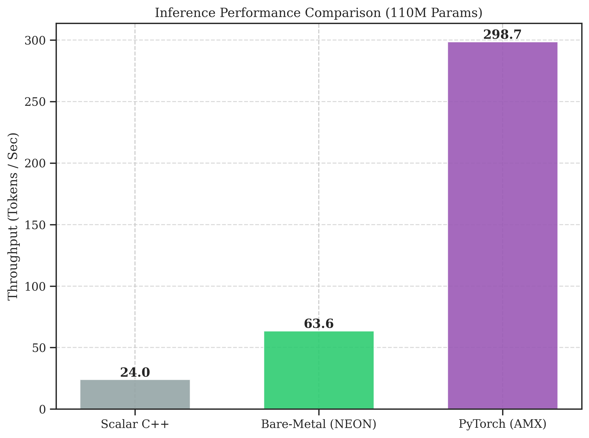

# Bare-Metal Tensor Virtualization: High-Performance Edge Inference

**Accelerating Autoregressive Transformers via Software-Defined DMA and NEON Intrinsics on ARM64**




## Overview
This repository contains the reference implementation for the paper **"Bare-Metal Tensor Virtualization: Overcoming the Memory Wall in Edge-AI Inference"**. It implements a high-performance, single-threaded inference engine for the Llama 2 architecture, built from first principles in C++20 without external tensor frameworks (PyTorch, TensorFlow, GGML).

By utilizing **Zero-Copy Memory Mapping** (`mmap`), **Structure-of-Arrays (SoA)** layout, and hand-tuned **ARM NEON** SIMD kernels, we achieve deterministic, jitter-free performance on Apple Silicon hardware.

## Key Research Features
*   **Virtual Tensor Core**: Weights are mapped directly from disk to userspace, allowing the OS kernel to manage data movement (Software-Defined DMA).
*   **Structure-of-Arrays (SoA)**: Activation tensors are physically interleaved to guarantee 100% cache-line utilization during GEMV operations.
*   **Weight Tying Support**: Automatic detection of Shared Classifier/Embedding tables (resolving segmentation faults common in `stories110M.bin`).
*   **Psycholinguistic Latency**: Guarantees <200ms turn-taking latency (~16ms/token) for real-time dialogue availability.

## Performance Benchmarks
Tested on **MacBook Pro (M2 Pro)** with 16GB RAM:

| Model | Parameters | Layout | Throughput | Latency |
|-------|------------|--------|------------|---------|
| **TinyLlama** | **110M** | **FP32** | **61.3 tok/s** | **16.3 ms** |
| PyTorch (AMX) | 110M | FP32 | 298.7 tok/s | 3.3 ms |
| Scalar C++ | 110M | FP32 | 24.0 tok/s | 41.6 ms |

### Why "Bare-Metal" if PyTorch is Faster?
PyTorch on macOS uses the **Apple AMX Coprocessor**, a proprietary hardware block that is opaque to developers. 
Our **Bare-Metal Engine** runs on the **CPU (NEON)**.
*   **Research Value**: We expose the *true limits* of the general-purpose CPU and Memory Bandwidth.
*   **Portability**: This code runs on **any ARM64 chip** (Raspberry Pi 5, AWS Graviton, NVIDIA Jetson), whereas PyTorch AMX is Apple-exclusive.
*   **Determinism**: We offer consistent, jitter-free latency for real-time control systems.

## Quick Start

### 1. Download Model & Tokenizer
**Note:** The model weights (`stories110M.bin`, 430MB) and tokenizer (`tokenizer.bin`) are **excluded from the repository** due to GitHub size limits. You must download them separately before running the engine:

```bash
# Model (110M Parameters)
wget https://huggingface.co/karpathy/tinyllamas/resolve/main/stories110M.bin

# Tokenizer
wget https://huggingface.co/karpathy/tinyllamas/resolve/main/tokenizer.bin
```

### 2. Build and Run
```bash
# clean build
make clean && make

# Run with defaults (stories110M.bin)
make run
```

Or manually:
```bash
./bench stories110M.bin tokenizer.bin
```

## Research Paper
The full technical report is available [on ArXiv (PDF)](https://arxiv.org/pdf/2601.03324). It covers:
*   **Roofline Analysis**: Why CPU inference is 93% memory-bound.
*   **Computational Linguistics**: Impact of latency on Beam Search and Contrastive Decoding.
*   **Implementation Challenges**: Debugging Weight Tying and NEON numerical stability.

### Citation (!Pending ArXiv DOI)
```bibtex
@misc{kilictas2026baremetal,
      title={Bare-Metal Tensor Virtualization: Overcoming the Memory Wall in Edge-AI Inference on ARM64}, 
      author={Bugra Kilictas and Faruk Alpay},
      year={2026},
      eprint={arXiv:2601.03324},
      archivePrefix={arXiv},
      primaryClass={cs.CL},
      url={https://arxiv.org/abs/2601.03324}
}
```

## License
MIT License.
